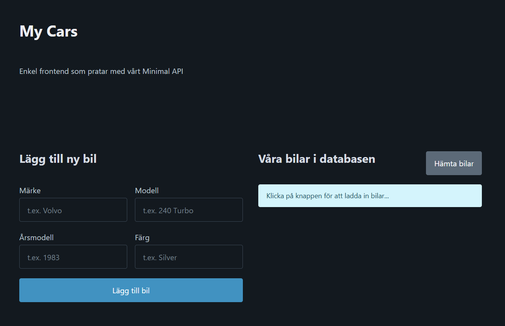

# Exercise 8: "Cars" (TypeScript Fetch API & Full CRUD)



## Project Purpose
The purpose of this project is to build a full CRUD (Create, Read, Update, Delete) single-page application using TypeScript, Fetch API with `async/await`, and an ASP.NET Core Minimal Web API backend. Managing a car database stored in SQLite, the application implements dynamic DOM updates, HTML `<template>` cloning, optimistic state caching, event delegation, strict typing, and robust asynchronous error handling.

## Core Technologies
* **TypeScript & SoC:** Modular architecture implementing Separation of Concerns across dedicated layers (`api.ts`, `ui.ts`, `types.ts`, and `main.ts`), utilizing strict typing, interfaces, `async/await`, `fetch()` API calls, local state caching, and event delegation.
* **REST API & .NET:** ASP.NET Core Minimal API targeting .NET 10 with SQLite (`cars.db`), serving endpoints for full HTTP CRUD operations (`GET`, `POST`, `PUT`, `DELETE`).
* **DOM API & HTML5 Templates:** Dynamic DOM population using `<template>` cloning (`cloneNode`), DOM node clearing via `replaceChildren()`, and dataset attribute routing (`data-id`, `data-action`).
* **Vite:** High-performance frontend development server providing Hot Module Replacement (HMR) and production bundling.

## Project Structure
The repository contains a decoupled architecture with a `.NET 10` Web API backend and a Vite-powered TypeScript frontend.

```text
/root
 ├── backend/               # ASP.NET Core Minimal API backend
 │   ├── Properties/        # Environment and launch settings
 │   ├── appsettings.Development.json
 │   ├── appsettings.json   # Backend configuration settings
 │   ├── CarApi.csproj      # C# project file (.NET 10)
 │   ├── cars.db            # SQLite database file
 │   └── Program.cs         # Minimal API endpoint definitions and database configuration
 ├── docs/                  # Assignment documentation and reference material
 │   ├── examples/          # Code blueprints and reference implementations
 │   │   ├── demo.html      # Demo HTML file
 │   │   └── demo.ts        # Demo TypeScript file
 │   ├── exercise/          # Assignment instructions and guides
 │   │   └── Övning8 Cars med Typescript.pdf
 │   └── theory/            # Background theory documentation
 │       ├── Typescript NPM och Vite.pdf
 │       ├── Typescript Typer.pdf
 │       └── Typescript.pdf
 ├── frontend/              # Vite-powered frontend application
 │   ├── public/            # Static application icons and assets
 │   ├── src/               # Frontend source code
 │   │   ├── api.ts         # REST API communication layer and status logging
 │   │   ├── main.ts        # Application entry point, state, and event orchestration
 │   │   ├── style.css      # Custom UI styles
 │   │   ├── types.ts       # Shared TypeScript interfaces and type definitions
 │   │   └── ui.ts          # DOM manipulation, form handling, and UI rendering
 │   ├── index.html         # Application entry point containing HTML template
 │   ├── package-lock.json
 │   ├── package.json
 ├── .gitignore
 ├── tsconfig.json          # TypeScript compiler configuration
 └── README.md              # Project documentation file
```

## Core Assignment Features

### Read (GET)
* Fetches the car collection from `/api/cars` asynchronously.
* Clears existing list items using `replaceChildren()` and dynamically renders records using `<template>` cloning.
* Toggles empty database UI status messages when no items exist.

### Create (POST)
* Form submission dispatcher captures input values and sends a `POST` request to `/api/cars`.
* Appends newly created entities directly to the cached local state and renders them to the DOM without requiring a full page refresh.

### Update (PUT)
* Triggers edit mode by populating input fields from cached data and switching form state button texts.
* Issues `PUT` requests to `/api/cars/{id}` and updates matching DOM elements dynamically upon success.

### Delete (DELETE)
* Utilizes event delegation on the main list wrapper (`carList`) to capture action triggers (`button[data-action="delete"]`).
* Confirms user intent, sends a `DELETE` request to `/api/cars/{id}`, removes the target node from the DOM, and automatically resets the edit form if the deleted item was currently being edited.

## Getting Started

### 1. Start the Backend API
Navigate to the `backend` directory and run the ASP.NET Core Minimal API server:
```bash
cd backend
dotnet run
```
The API backend will start listening at `http://localhost:5111`.

### 2. Install Frontend Dependencies
In a separate terminal window, navigate to the `frontend` directory and install required packages:
```bash
cd frontend
npm install
```

### 3. Start the Development Server
Launch the Vite local development server:
```bash
npm run dev
```
Open the local URL displayed in the terminal (e.g., `http://localhost:5173`) in your browser.

### 4. Build for Production
To generate minified production assets inside `frontend/dist/`:
```bash
npm run build
```

## Course Information
* **Provider:** Lexicon IT-proffs AB / Luleå Tekniska Universitet (LTU)
* **Class:** Lexicon LTU VT-2026
* **Track:** Frontend
* **Course:** TypeScript

**Tags:** `typescript`, `crud`, `async-await`, `fetch-api`, `csharp`, `dotnet`, `webapi`, `rest-api`, `minimal-api`, `fullstack`, `vite`